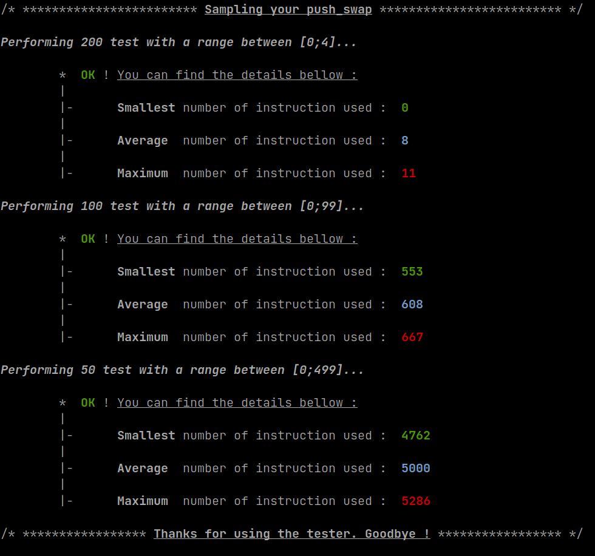

# 42-push_swap_tester
A simple push_swap tester.

[](https://shields.io/)
[](https://www.vim.org/)
[](https://shields.io/)
[](https://shields.io/)
[](https://shields.io/)

[](http://commonmark.org)
[](https://GitHub.com/Naereen/ama)

This mini-project is made for testing Push_Swap. This taught me how to use **exec()** family function and basic of piping and the use of **dup2()**. Usefull for the next minishell project.

## Screenshot



## Functionality

* Basic testing.
* Average, minimum and maximum.
* (WIP) Log if a sample test failed.

## Setup & Usage

The usage of this tester is simple, clone the project using the command

```
git clone --recurse-submodules --remote-submodules https://github.com/noctuelles/42-push_swap_tester
cd 42-push_swap_tester
```

Next, you want to specify the path of your **checker** (you can use the one that 42 provide), the path of your **push_swap** in the header **user_define** located in **includes** :

```<your_favorite_editor> includes/user_define.h```

I recommand you copying your push_swap binary and the checker binary into the tester folder.

```
/* ************************************************************************** */
/*                                                                            */
/*                                                        :::      ::::::::   */
/*   user_define.h                                      :+:      :+:    :+:   */
/*                                                    +:+ +:+         +:+     */
/*   By: plouvel <plouvel@student.42.fr>            +#+  +:+       +#+        */
/*                                                +#+#+#+#+#+   +#+           */
/*                                                     #+#    #+#             */
/*                                                    ###   ########.fr       */
/*                                                                            */
/* ************************************************************************** */

#ifndef USER_DEFINE_H
# define USER_DEFINE_H

# define NBR_TEST_1         200
# define NBR_TEST_1_RANGE_A "0"
# define NBR_TEST_1_RANGE_B "4"

# define NBR_TEST_2         100
# define NBR_TEST_2_RANGE_A "0"
# define NBR_TEST_2_RANGE_B "99"

# define NBR_TEST_3         50
# define NBR_TEST_3_RANGE_A "0"
# define NBR_TEST_3_RANGE_B "499"

# define RND_PATH           "random.sh"
# define PS_PATH            "push_swap"
# define CHK_PATH           "checker"
# define WC_PATH            "/usr/bin/wc"

#endif
```

You can also change for each sampling, the number of test that will be executed and the range. 

"0" "99" means you're executing test with **100 random numbers**, within range of **0-100**.

Then

```
make
./push_swap_tester
```
